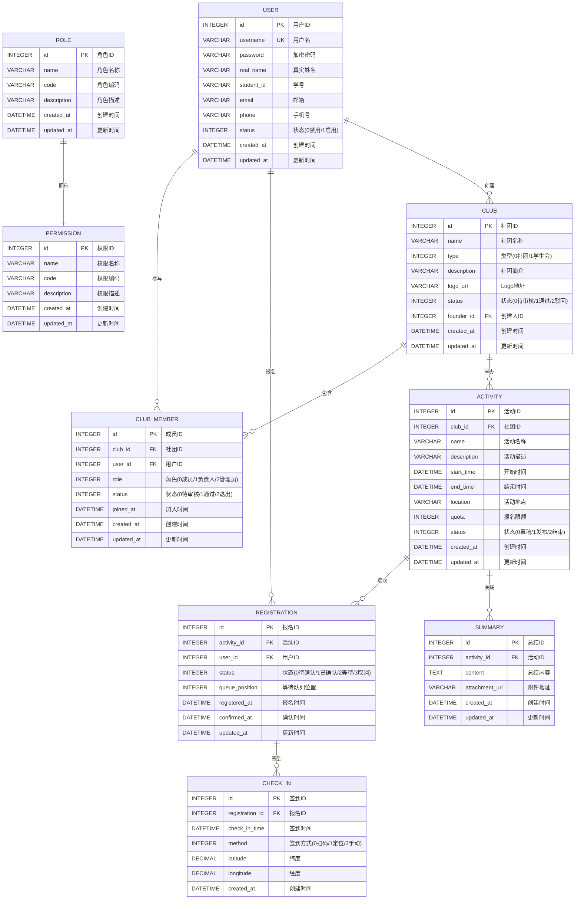

# ER图设计

## 实体关系图

## 关系说明

| 关系 | 说明 | 基数 |
|------|------|------|
| USER -> CLUB | 用户创建社团 | 1:N |
| USER -> CLUB_MEMBER | 用户加入社团 | 1:N |
| USER -> REGISTRATION | 用户报名活动 | 1:N |
| CLUB -> CLUB_MEMBER | 社团包含成员 | 1:N |
| CLUB -> ACTIVITY | 社团举办活动 | 1:N |
| ACTIVITY -> REGISTRATION | 活动接收报名 | 1:N |
| ACTIVITY -> SUMMARY | 活动关联总结 | 1:1 |
| REGISTRATION -> CHECK_IN | 报名关联签到 | 1:1 |
| ROLE -> PERMISSION | 角色拥有权限 | N:M |
