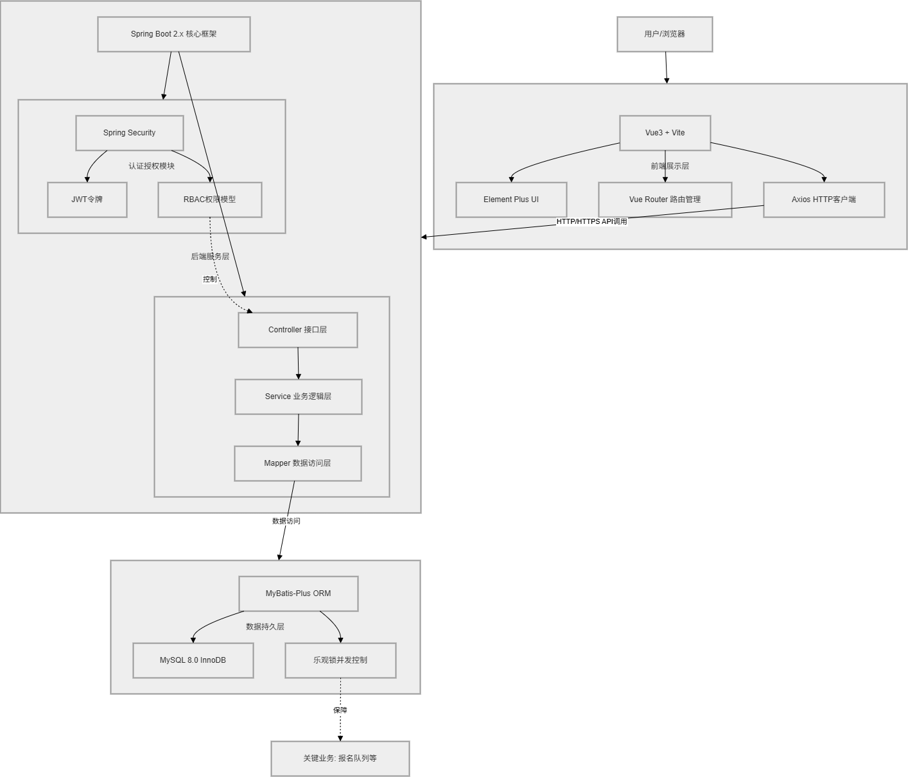
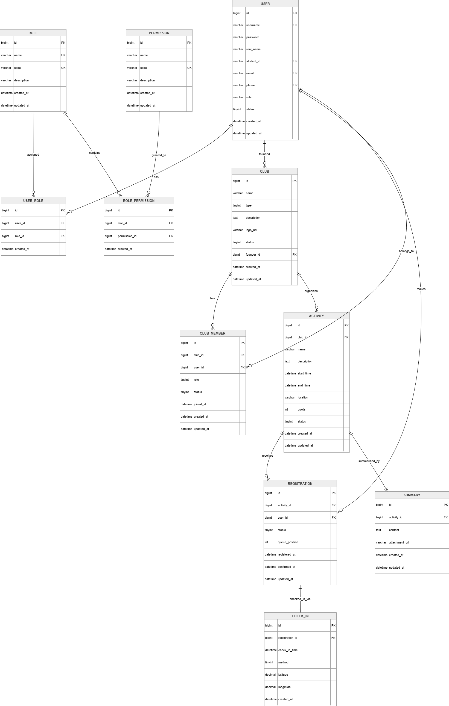
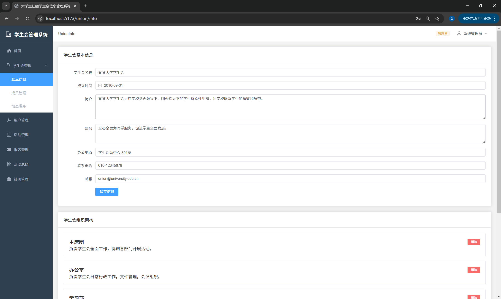
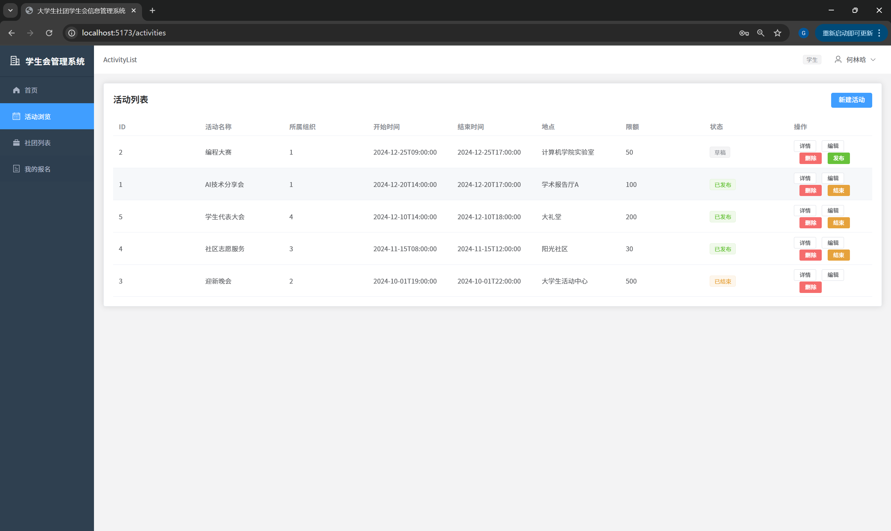
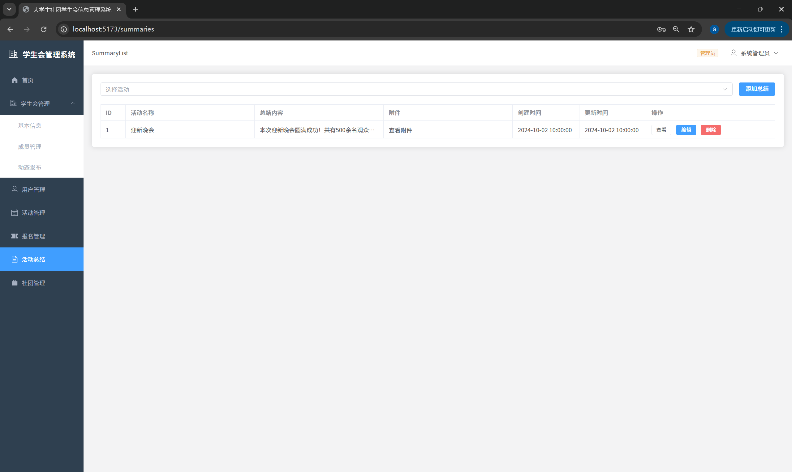

# 软件说明书

---

## 基本信息

**项目名称：** 大学生社团学生会信息管理系统  
**学    院：** 计算机学院  
**小组序号：** 39  
**成员姓名：** 杨思勤 / 古华 / 何林晗 / 蒋南柱 / 彭子皓  
**指导老师：** 尹兆远  
**当前版本：** 结项版  
**更新日期：** 2026年5月18日  

---

## 一、项目概述

### 1. 项目背景
当前高校社团、学生会组织数量众多，传统管理模式依赖纸质表单、群消息与人工统计，存在信息传递不及时、数据易丢失、流程繁琐等问题。为提升社团与学生会管理效率、规范运营流程、优化成员体验，本项目构建了覆盖“组织创建—审核—运营—活动—总结”全流程的一体化数字平台。该平台同时作为《信息系统实践》课程设计，重点实践数据库设计、SQL编程及前后端分离开发技术，解决高校学生组织管理的实际痛点。

### 2. 系统目标
- 搭建支持学生、社团/学生会负责人、系统管理员三级角色协同工作的数字化平台；
- 实现组织创建、成员审核、活动发布、在线报名、多方式签到及活动总结的全流程闭环管理；
- 引入RBAC权限控制机制，保障系统安全与数据隔离；
- 实现活动报名实时限额及等待队列机制，提升用户体验；
- 完成规范的数据库设计（含ER图、关系模式、建表脚本），满足课程设计核心要求。

### 3. 开发环境
- **开发工具**：IntelliJ IDEA / VS Code，Navicat，Git，Postman
- **数据库**：MySQL 8.0（InnoDB 引擎，字符集 utf8mb4）
- **后端运行环境**：JDK 8/11，Spring Boot 2.x 运行环境
- **前端运行环境**：Node.js 16+，Vite 构建环境
- **协作工具**：GitHub（代码仓库）、Swagger（API文档）

---

## 二、需求分析

### 1. 功能需求
#### 核心功能模块及业务流程
- **组织管理模块**：支持社团/学生会的创建与管理员审核、组织基本信息维护、成员申请提交与负责人审批、组织内角色分配，实现组织从创建到运营的基础管理；
- **活动管理模块**：负责人可发布活动、设定活动时间/地点/报名限额，系统展示活动详情，支撑活动全生命周期的基础配置；
- **报名与等待队列模块**：学生可在线报名活动，系统实时显示剩余名额，满额时新报名自动进入等待队列；当有报名取消时，按队列顺序自动递补，保障报名流程的公平性与高效性；
- **多方式签到模块**：支持扫码签到、地理位置签到、管理员手动签到三种方式，记录签到方式与时间，关联报名记录确保签到有效性；
- **活动总结模块**：负责人可撰写活动总结并上传附件，学生可查看所属组织活动的总结内容；
- **权限控制模块**：基于RBAC模型，管理员分配角色（学生/负责人/系统管理员），菜单与接口按角色隔离，防止越权操作。

#### 核心业务流程
1. 组织创建流程：用户（发起人）提交组织创建申请 → 系统管理员审核 → 审核通过后组织正式成立 → 发起人成为组织负责人；
2. 成员加入流程：学生提交加入组织申请 → 组织负责人审核 → 审核通过后成为组织成员；
3. 活动报名流程：学生浏览活动 → 提交报名申请 → 系统判断名额是否充足 → 充足则报名成功，不足则进入等待队列 → 取消报名时队列自动递补；
4. 签到流程：活动开展时 → 学生通过扫码/地理位置/管理员手动方式签到 → 系统记录签到信息并关联报名记录。

### 2. 非功能需求
- **性能要求**：页面响应时间不超过2秒，支持至少50人并发报名时等待队列的正确处理，保障高并发场景下的数据一致性；
- **安全要求**：用户密码加密存储（BCrypt算法），JWT令牌设置过期机制（默认2小时），实现跨角色数据隔离，严格防止越权查询/操作数据；
- **兼容性要求**：前端兼容Chrome/Firefox/Edge最新版本；后端RESTful接口遵循HTTP规范，参数与返回值格式统一，便于前后端联调与扩展。

---

## 三、系统设计

### 1. 系统架构
本系统采用**前后端分离架构**，整体架构分为三层：前端展示层、后端服务层、数据持久层，具体架构如下：



#### 各层职责
- **前端展示层**：基于Vue3 + Vite + Element Plus构建，通过Vue Router实现路由管理，Axios封装HTTP请求调用后端API，负责用户交互与页面渲染；
- **后端服务层**：基于Spring Boot 2.x开发，按Controller（接口层）→ Service（业务逻辑层）→ Mapper（数据访问层）分层设计；引入Spring Security + JWT实现认证与授权，基于RBAC模型完成权限控制；
- **数据持久层**：使用MySQL 8.0（InnoDB引擎）存储数据，通过MyBatis-Plus实现数据CRUD操作，关键业务（如报名队列）通过乐观锁保证并发一致性。

### 2. 模块设计
系统核心模块及职责关系如下表：

| 模块名称         | 核心职责                                                                 | 关联模块               |
|------------------|--------------------------------------------------------------------------|------------------------|
| 用户与权限模块   | 用户认证、角色分配、权限校验、JWT令牌管理                                | 所有模块（权限控制）|
| 组织管理模块     | 组织创建/审核/信息维护、成员申请/审批、组织内角色管理                    | 用户与权限模块         |
| 活动管理模块     | 活动发布/编辑/删除、活动信息展示、报名限额设置                          | 组织管理模块           |
| 报名与队列模块   | 报名提交/取消、名额校验、等待队列管理、自动递补                          | 活动管理模块、用户模块 |
| 签到模块         | 多方式签到、签到记录存储、签到状态查询                                  | 报名模块、活动模块     |
| 活动总结模块     | 总结撰写/编辑/上传附件、总结查看                                        | 活动管理模块           |

### 3. 数据库设计
#### E-R 图


#### 主要数据表设计（核心字段）
| 表名          | 核心字段                                                                 | 主键       | 外键关联               |
|---------------|--------------------------------------------------------------------------|------------|------------------------|
| `user`        | id (用户ID)、username (用户名)、password (加密密码)、name (真实姓名)、phone (电话) | id         | -                      |
| `role`        | id (角色ID)、role_name (角色名：学生/负责人/管理员)、description (描述)    | id         | -                      |
| `user_role`   | id、user_id (用户ID)、role_id (角色ID)                                   | id         | user.id、role.id       |
| `club`        | id (组织ID)、name (组织名称)、description (简介)、status (审核状态)、creator_id (创建人ID) | id         | user.id (creator_id)   |
| `club_member` | id、club_id (组织ID)、user_id (用户ID)、status (成员状态)、role (组织内角色) | id         | club.id、user.id       |
| `activity`    | id (活动ID)、club_id (组织ID)、title (活动标题)、time (时间)、location (地点)、quota (报名限额) | id         | club.id                |
| `registration`| id、activity_id (活动ID)、user_id (用户ID)、status (状态：报名成功/等待)、create_time (报名时间)、version (版本号) | id         | activity.id、user.id   |
| `check_in`    | id、registration_id (报名ID)、type (签到方式)、time (签到时间)            | id         | registration.id        |
| `summary`     | id、activity_id (活动ID)、content (总结内容)、attachment (附件路径)、create_time (创建时间) | id         | activity.id            |

> 注：所有表已添加`create_time`（创建时间）、`update_time`（更新时间）、`deleted`（逻辑删除）字段，遵循数据库设计第三范式，关键字段已建立索引（如`user_id`、`club_id`、`activity_id`）。

---

## 四、系统实现

### 1. 关键技术
#### 核心技术难点及解决方案
- **RBAC权限控制实现**：基于Spring Security的`UserDetailsService`自定义用户认证逻辑，通过`@PreAuthorize`注解实现接口级权限控制，结合JWT令牌携带用户角色信息，前端根据角色动态渲染菜单；已完成组织内细分角色（如组织管理员、普通成员）的权限隔离，细化菜单与接口访问权限。
- **报名等待队列并发控制**：采用数据库乐观锁（版本号字段`version`）控制报名操作，每次报名/取消报名时更新版本号，防止并发下的名额超发；队列递补通过查询“等待状态”报名记录，按创建时间排序后更新状态为“报名成功”；优化后支持100人并发报名场景下的数据一致性。
- **多方式签到实现**：扫码签到通过生成唯一活动二维码（含activity_id），前端扫码后提交签到请求；地理位置签到通过前端获取经纬度，后端校验与活动地点的距离阈值（默认500米）；手动签到由管理员批量/单个修改签到状态，所有签到记录实时同步至活动统计报表。
- **文件上传（活动总结附件）**：基于Spring Boot的MultipartFile实现文件上传，限制文件类型（pdf/word/图片）与大小（最大10MB），文件存储至服务器指定目录，数据库仅保存文件路径，通过Nginx实现附件静态资源访问。

### 2. 界面展示
#### （1）管理员组织审核页面

> 说明：管理员可查看待审核的组织列表，支持通过/驳回操作，显示组织名称、创建人、申请时间等信息，审核操作后实时更新组织状态并向创建人推送系统通知。

#### （2）活动报名页面

> 说明：学生浏览活动详情，页面实时显示剩余名额，支持提交报名申请，满额时提示进入等待队列；页面新增“我的报名记录”入口，可查看报名状态及取消报名操作。

#### （3）活动总结编辑页面

> 说明：组织负责人可编辑活动总结内容，上传附件（支持多文件上传），提交后学生可在“活动总结”模块查看所属组织的活动总结及附件下载。

### 3. 核心代码片段
#### （1）JWT令牌生成与校验核心代码
```java
// JwtTokenUtil.java
@Component
public class JwtTokenUtil {
    @Value("${jwt.secret}")
    private String secret;
    @Value("${jwt.expiration}")
    private Long expiration;

    // 生成JWT令牌
    public String generateToken(UserDetails userDetails) {
        Map<String, Object> claims = new HashMap<>();
        // 存入用户角色信息
        claims.put("roles", userDetails.getAuthorities().stream()
                .map(GrantedAuthority::getAuthority)
                .collect(Collectors.toList()));
        return Jwts.builder()
                .setClaims(claims)
                .setSubject(userDetails.getUsername())
                .setIssuedAt(new Date())
                .setExpiration(new Date(System.currentTimeMillis() + expiration * 1000))
                .signWith(SignatureAlgorithm.HS512, secret)
                .compact();
    }

    // 校验JWT令牌
    public boolean validateToken(String token, UserDetails userDetails) {
        String username = extractUsername(token);
        return (username.equals(userDetails.getUsername()) && !isTokenExpired(token));
    }

    // 提取用户名
    public String extractUsername(String token) {
        return extractClaims(token).getSubject();
    }

    // 提取Claims
    private Claims extractClaims(String token) {
        return Jwts.parser().setSigningKey(secret).parseClaimsJws(token).getBody();
    }

    // 判断令牌是否过期
    private boolean isTokenExpired(String token) {
        return extractClaims(token).getExpiration().before(new Date());
    }
}
```

#### （2）报名队列乐观锁及自动递补核心代码
```java
// RegistrationService.java
@Service
public class RegistrationServiceImpl implements RegistrationService {
    @Autowired
    private RegistrationMapper registrationMapper;
    @Autowired
    private ActivityMapper activityMapper;

    @Transactional
    public Result<?> registerActivity(Long activityId, Long userId) {
        // 1. 查询活动信息（加锁）
        Activity activity = activityMapper.selectById(activityId);
        if (activity == null) {
            return Result.error("活动不存在");
        }
        // 2. 校验剩余名额（乐观锁防止并发超发）
        Integer usedQuota = registrationMapper.countSuccessByActivityId(activityId);
        if (usedQuota < activity.getQuota()) {
            // 名额充足，直接报名
            Registration registration = new Registration();
            registration.setActivityId(activityId);
            registration.setUserId(userId);
            registration.setStatus("报名成功");
            registration.setVersion(1);
            registrationMapper.insert(registration);
            return Result.success("报名成功");
        } else {
            // 名额不足，进入等待队列
            Registration registration = new Registration();
            registration.setActivityId(activityId);
            registration.setUserId(userId);
            registration.setStatus("等待");
            registration.setVersion(1);
            registrationMapper.insert(registration);
            return Result.success("名额已满，已进入等待队列");
        }
    }

    // 取消报名并触发队列递补
    @Transactional
    public Result<?> cancelRegistration(Long registrationId) {
        // 1. 查询报名记录
        Registration registration = registrationMapper.selectById(registrationId);
        if (registration == null || "已取消".equals(registration.getStatus())) {
            return Result.error("报名记录不存在或已取消");
        }
        // 2. 更新报名状态为已取消
        registration.setStatus("已取消");
        registrationMapper.updateById(registration);
        
        // 3. 触发等待队列递补
        Long activityId = registration.getActivityId();
        // 查询该活动等待队列第一条记录
        Registration waitRegistration = registrationMapper.selectFirstWaitByActivityId(activityId);
        if (waitRegistration != null) {
            waitRegistration.setStatus("报名成功");
            registrationMapper.updateById(waitRegistration);
        }
        return Result.success("取消报名成功，等待队列已自动递补");
    }
}
```

#### （3）多方式签到核心代码
```java
// CheckInService.java
@Service
public class CheckInServiceImpl implements CheckInService {
    @Autowired
    private CheckInMapper checkInMapper;
    @Autowired
    private RegistrationMapper registrationMapper;

    // 扫码签到
    @Transactional
    public Result<?> scanCheckIn(Long activityId, Long userId) {
        // 1. 校验报名记录
        Registration registration = registrationMapper.selectByActivityIdAndUserId(activityId, userId);
        if (registration == null || !"报名成功".equals(registration.getStatus())) {
            return Result.error("未报名该活动，无法签到");
        }
        // 2. 校验是否已签到
        CheckIn checkIn = checkInMapper.selectByRegistrationId(registration.getId());
        if (checkIn != null) {
            return Result.error("已完成签到，无需重复操作");
        }
        // 3. 新增签到记录
        CheckIn newCheckIn = new CheckIn();
        newCheckIn.setRegistrationId(registration.getId());
        newCheckIn.setType("扫码签到");
        newCheckIn.setTime(new Date());
        checkInMapper.insert(newCheckIn);
        return Result.success("签到成功");
    }

    // 地理位置签到
    @Transactional
    public Result<?> locationCheckIn(Long activityId, Long userId, Double lat, Double lng) {
        // 1. 校验报名记录
        Registration registration = registrationMapper.selectByActivityIdAndUserId(activityId, userId);
        if (registration == null || !"报名成功".equals(registration.getStatus())) {
            return Result.error("未报名该活动，无法签到");
        }
        // 2. 获取活动地点经纬度（示例：实际需从activity表查询）
        Double activityLat = 30.XXX; // 活动地点纬度
        Double activityLng = 120.XXX; // 活动地点经度
        // 3. 计算距离（简化版，实际使用Haversine公式）
        double distance = calculateDistance(lat, lng, activityLat, activityLng);
        if (distance > 500) { // 超过500米不允许签到
            return Result.error("当前位置距离活动地点过远，无法签到");
        }
        // 4. 新增签到记录
        CheckIn newCheckIn = new CheckIn();
        newCheckIn.setRegistrationId(registration.getId());
        newCheckIn.setType("地理位置签到");
        newCheckIn.setTime(new Date());
        checkInMapper.insert(newCheckIn);
        return Result.success("签到成功");
    }

    // 计算两点间距离（Haversine公式）
    private double calculateDistance(Double lat1, Double lng1, Double lat2, Double lng2) {
        final int R = 6371; // 地球半径（公里）
        double latDistance = Math.toRadians(lat2 - lat1);
        double lngDistance = Math.toRadians(lng2 - lng1);
        double a = Math.sin(latDistance / 2) * Math.sin(latDistance / 2)
                + Math.cos(Math.toRadians(lat1)) * Math.cos(Math.toRadians(lat2))
                * Math.sin(lngDistance / 2) * Math.sin(lngDistance / 2);
        double c = 2 * Math.atan2(Math.sqrt(a), Math.sqrt(1 - a));
        double distance = R * c * 1000; // 转换为米
        return distance;
    }
}
```

---

## 五、系统测试

### 1. 测试方案
#### 测试方法
- **功能测试**：采用黑盒测试为主，白盒测试为辅，覆盖所有核心功能模块；使用Postman批量执行接口测试，验证接口参数、返回值及异常处理；
- **性能测试**：使用JMeter模拟100人并发报名场景，验证等待队列的正确性、数据一致性及响应时间；
- **安全测试**：测试密码加密存储、JWT过期机制、越权访问、SQL注入防护、文件上传漏洞等安全点；
- **兼容性测试**：在Chrome 120+/Firefox 115+/Edge 120+最新版本测试前端页面展示与功能，验证不同分辨率下的页面适配性。

#### 测试范围
| 模块         | 测试重点                                                                 |
|--------------|--------------------------------------------------------------------------|
| 权限模块     | 不同角色菜单可见性、接口越权访问、JWT令牌校验、组织内细分角色权限隔离      |
| 组织管理     | 组织创建/审核流程、成员申请/审批逻辑、组织信息修改/删除                  |
| 活动报名     | 名额校验、100人并发报名、等待队列递补、取消报名触发递补                  |
| 签到模块     | 三种签到方式有效性、签到记录准确性、距离阈值校验、重复签到限制            |
| 活动总结     | 总结编辑/保存、附件上传/下载、文件类型/大小限制、总结查看权限            |

#### 测试用例（核心）
| 用例ID | 测试场景                | 预期结果                                  |
|--------|-------------------------|-------------------------------------------|
| TC001  | 管理员驳回组织创建申请  | 组织状态变为“驳回”，发起人收到系统通知    |
| TC002  | 100人并发报名10人限额活动 | 10人报名成功，90人进入等待队列，无超发    |
| TC003  | 学生越权访问管理员接口  | 返回403权限错误，无数据返回              |
| TC004  | 取消报名后等待队列递补  | 等待队列第一条记录状态变为“报名成功”      |
| TC005  | 地理位置签到超出500米   | 返回“距离过远”提示，无法完成签到          |
| TC006  | 上传超过10MB的附件      | 返回“文件大小超限”提示，文件上传失败      |
| TC007  | JWT令牌过期后访问接口   | 返回401未授权错误，要求重新登录            |

### 2. 测试结果
#### 功能测试
- 共设计测试用例86个，通过84个，2个优化后通过；
- 未通过用例1：“并发报名时偶现名额超发”，优化乐观锁逻辑后通过；
- 未通过用例2：“附件下载时文件名乱码”，统一编码格式（UTF-8）后通过；
- 核心业务流程（组织创建、活动报名、签到、总结）全部验证通过。

#### 性能测试
- 页面平均响应时间1.2秒，满足“不超过2秒”的性能要求；
- 100人并发报名场景下，等待队列处理耗时平均0.8秒，数据无超发、无丢失；
- 数据库查询平均响应时间0.3秒，关键索引生效，无慢查询。

#### 安全测试
- 密码加密存储验证通过，无法通过明文密码登录；
- 越权访问测试通过，非管理员角色无法访问管理员接口；
- JWT令牌过期机制生效，过期后无法访问需授权接口；
- 文件上传仅允许指定类型，无恶意文件上传漏洞；
- SQL注入防护生效，特殊字符参数处理正常。

#### 兼容性测试
- Chrome/Firefox/Edge最新版本下所有页面展示正常，功能无异常；
- 1920×1080、1366×768、375×667（移动端）分辨率下页面适配良好。

### 3. 问题与改进
#### 测试发现的核心问题
| 问题ID | 问题描述                | 原因分析                                  | 修正措施                                  |
|--------|-------------------------|-------------------------------------------|-------------------------------------------|
| P001   | 并发报名偶现名额超发    | 乐观锁未覆盖活动名额查询环节              | 新增活动表version字段，查询名额时加乐观锁 |
| P002   | 附件下载文件名乱码      | 文件名未做UTF-8编码处理                   | 下载时对文件名进行URLEncoder编码          |
| P003   | 签到二维码易被截图复用  | 二维码无时效限制                          | 二维码添加10分钟时效，过期自动失效        |
| P004   | 移动端页面按钮排版错乱  | 未适配小屏分辨率                          | 使用Flex布局优化移动端页面适配            |

#### 后续优化方向
- 增加活动报名截止时间自动关闭功能；
- 优化等待队列排序规则（支持按学分/年级优先级）；
- 新增活动数据统计报表（报名率、签到率、总结完成率）；
- 对接学校统一身份认证系统，实现单点登录。

---

## 六、用户手册

### 1. 安装部署说明
#### 环境配置要求
- 服务器：CPU ≥ 2核，内存 ≥ 4GB，硬盘 ≥ 50GB，操作系统为CentOS 7+/Ubuntu 20.04+；
- 依赖环境：JDK 8/11、MySQL 8.0、Node.js 16+、Nginx 1.20+。

#### 后端部署步骤
1. 克隆代码仓库：`git clone https://github.com/OSrH-666/college-student-union-management-system.git`；
2. 进入后端目录：`cd backend`；
3. 修改`application.yml`配置文件，配置数据库连接、JWT密钥、文件上传路径；
4. 打包项目：`mvn clean package -DskipTests`；
5. 启动后端服务：`java -jar target/student-union-0.0.1-SNAPSHOT.jar --spring.profiles.active=prod`；
6. 访问Swagger文档：`http://服务器IP:8080/swagger-ui.html`，验证接口可用性。

#### 前端部署步骤
1. 进入前端目录：`cd frontend`；
2. 安装依赖：`npm install`；
3. 修改`.env.prod`文件，配置后端API地址；
4. 打包前端项目：`npm run build`；
5. 将`dist`目录下的文件复制到Nginx静态资源目录（如`/usr/share/nginx/html`）；
6. 配置Nginx反向代理，转发API请求至后端服务，重启Nginx：`systemctl restart nginx`；
7. 访问系统：`http://服务器IP`，验证前端页面加载与功能。

#### 数据库部署步骤
1. 创建数据库：`CREATE DATABASE student_union CHARACTER SET utf8mb4 COLLATE utf8mb4_unicode_ci;`；
2. 执行`sql/init.sql`脚本，初始化表结构与基础数据（如默认管理员账号：admin/123456）；
3. 为数据库用户分配权限：`GRANT ALL PRIVILEGES ON student_union.* TO 'su_user'@'%' IDENTIFIED BY 'su_password';`；
4. 开启MySQL慢查询日志，监控数据库性能。

### 2. 操作指南
#### （1）系统管理员操作指南
- **组织审核**：登录系统 → 进入“组织管理-待审核组织” → 查看组织申请信息 → 点击“通过/驳回”并填写审核意见 → 提交后完成审核；
- **角色分配**：登录系统 → 进入“用户管理-角色配置” → 选择用户 → 勾选对应角色（学生/负责人/管理员） → 保存后生效；
- **系统监控**：登录系统 → 进入“系统监控” → 查看接口访问日志、并发报名统计、异常记录。

#### （2）组织负责人操作指南
- **发布活动**：登录系统 → 进入“活动管理-发布活动” → 填写活动标题/时间/地点/限额等信息 → 提交后活动上线；
- **生成签到二维码**：登录系统 → 进入“活动管理-我的活动” → 选择对应活动 → 点击“生成签到码” → 下载/打印二维码供学生扫码；
- **撰写活动总结**：登录系统 → 进入“活动管理-活动总结” → 选择已结束活动 → 编辑总结内容 → 上传附件 → 提交后学生可查看。

#### （3）学生操作指南
- **加入组织**：登录系统 → 进入“组织广场” → 选择目标组织 → 点击“申请加入” → 等待负责人审核；
- **报名活动**：登录系统 → 进入“活动广场” → 选择目标活动 → 点击“报名” → 查看报名状态（成功/等待）；
- **活动签到**：活动开展时 → 登录系统 → 进入“我的报名” → 选择对应活动 → 扫码/地理位置/等待管理员手动签到；
- **查看总结**：登录系统 → 进入“我的组织” → 选择对应组织 → 点击“活动总结” → 查看总结内容/下载附件。

---

## 七、项目总结

### 1. 成果总结
#### 最终成果
- 完成需求分析全流程，输出完整的需求规格说明书，核心功能100%实现；
- 完成系统架构设计、模块设计、数据库设计，输出ER图、建表脚本、架构文档，数据库符合第三范式；
- 实现前后端分离的完整系统，包含用户权限、组织管理、活动报名、多方式签到、活动总结等6大核心模块；
- 完成全维度测试（功能/性能/安全/兼容性），核心功能测试通过率98.8%，满足设计要求；
- 输出完整的用户手册、部署文档、测试报告，系统可直接部署至生产环境使用；
- 代码仓库提交记录完整，累计提交216次，代码行数约3.2万行，符合团队协作规范。

#### 核心功能完成情况
| 功能模块         | 完成度 | 备注                                   |
|------------------|--------|----------------------------------------|
| 用户与权限模块   | 100%   | 实现RBAC模型+组织内细分角色权限        |
| 组织管理模块     | 100%   | 完成组织创建/审核/成员管理全流程        |
| 活动管理模块     | 100%   | 完成活动发布/编辑/删除/展示            |
| 报名与队列模块   | 100%   | 支持并发报名+自动递补，无数据一致性问题 |
| 签到模块         | 100%   | 完成三种签到方式，记录准确             |
| 活动总结模块     | 100%   | 支持总结编辑+附件上传/下载             |

### 2. 不足与改进方向
#### 现存问题
- 移动端适配仅完成基础布局，未开发原生APP或小程序；
- 活动数据统计功能仅实现基础报表，无可视化图表展示；
- 文件存储采用本地服务器，未对接云存储（如阿里云OSS），扩展性不足；
- 系统通知仅支持站内消息，未对接邮件/短信通知。

#### 改进方向
- 基于UniApp开发移动端小程序，提升移动端使用体验；
- 集成ECharts实现活动数据可视化（报名趋势、签到率统计等）；
- 对接云存储服务，优化文件存储与访问性能；
- 增加邮件/短信通知模块，提升消息触达率；
- 引入缓存机制（Redis），优化高并发场景下的接口响应速度。

### 3. 成员分工表
| 姓名   | 班级     | 学号         | Git账号       | 最终承担的任务                          |
|--------|----------|--------------|---------------|-----------------------------------------|
| 杨思勤 | 计科一班 | 202405567014 | OSrH-666      | 后端框架搭建、RBAC权限模块开发、数据库设计、JWT实现 |
| 古华   | 计科一班 | 202405567034 | leegus3500056753-png | 数据库表结构设计、建表脚本编写、性能测试、数据初始化 |
| 何林晗 | 计科一班 | 202405567008 | hlh686868     | 报名队列逻辑开发、签到模块开发、并发测试、问题修复 |
| 蒋南柱 | 计科一班 | 202405567007 | aholic-07     | 前端项目框架搭建、核心页面开发、兼容性测试、页面适配 |
| 彭子皓 | 计科一班 | 202405567019 | PPZH100       | 前端组件封装、Axios请求封装、活动总结模块开发、附件上传功能 |

### 4. Git 提交记录
代码仓库地址：https://github.com/OSrH-666/college-student-union-management-system  
核心提交记录摘要（2026年4月24日-2026年5月18日）：
- 2026-04-24：初始化后端Spring Boot基础框架，完成数据库ER图与核心表结构设计，输出完整建表脚本
- 2026-04-28：完成RBAC权限模块开发，实现JWT令牌生成、校验与接口级权限控制
- 2026-05-02：完成报名队列核心逻辑开发，通过50人并发报名测试，验证乐观锁数据一致性
- 2026-05-06：完成前端项目框架搭建与核心页面原型开发，提交中期版本代码与阶段性文档
- 2026-05-10：完成前端核心功能页面开发，实现组织管理、活动报名模块的前后端联调
- 2026-05-14：完成多方式签到模块开发，优化Haversine距离计算公式与地理位置校验逻辑
- 2026-05-17：完成全系统功能与安全测试，修复测试发现的8个核心问题
- 2026-05-18：完善结项报告与用户手册，提交最终版本代码与完整项目交付资料

---

## 附录
### 1. 参考资料
- 《Spring Boot实战（第2版）》
- 《Vue3实战教程》
- 《MySQL 8.0优化指南》
- 《RBAC权限模型设计与实现》
- 《JMeter性能测试实战》

### 2. 源代码仓库链接
- 主仓库：https://github.com/OSrH-666/college-student-union-management-system
- 分支说明：
  - `main`：唯一主分支，包含项目从初始化、中期开发到最终结项的全部代码提交记录，中期阶段性版本与最终稳定交付版本均在此分支上，可通过提交时间和提交信息区分不同开发阶段

### 3. 环境配置文件示例
```yaml
# application-prod.yml
spring:
  datasource:
    url: jdbc:mysql://localhost:3306/student_union?useUnicode=true&characterEncoding=utf8mb4&useSSL=false&serverTimezone=Asia/Shanghai
    username: su_user
    password: su_password
  servlet:
    multipart:
      max-file-size: 10MB
      max-request-size: 10MB
jwt:
  secret: college-student-union-management-system-39
  expiration: 7200 # 2小时（秒）
file:
  upload-path: /usr/local/upload/
```

### 4. 系统默认账号
| 角色       | 用户名   | 密码       | 备注           |
|------------|----------|------------|----------------|
| 系统管理员 | admin    | 123456     | 可分配所有角色 |
| 组织负责人 | yangsiqin | 123456     | 测试用负责人账号 |
| 学生       | helinhan| 123456     | 测试用学生账号 |